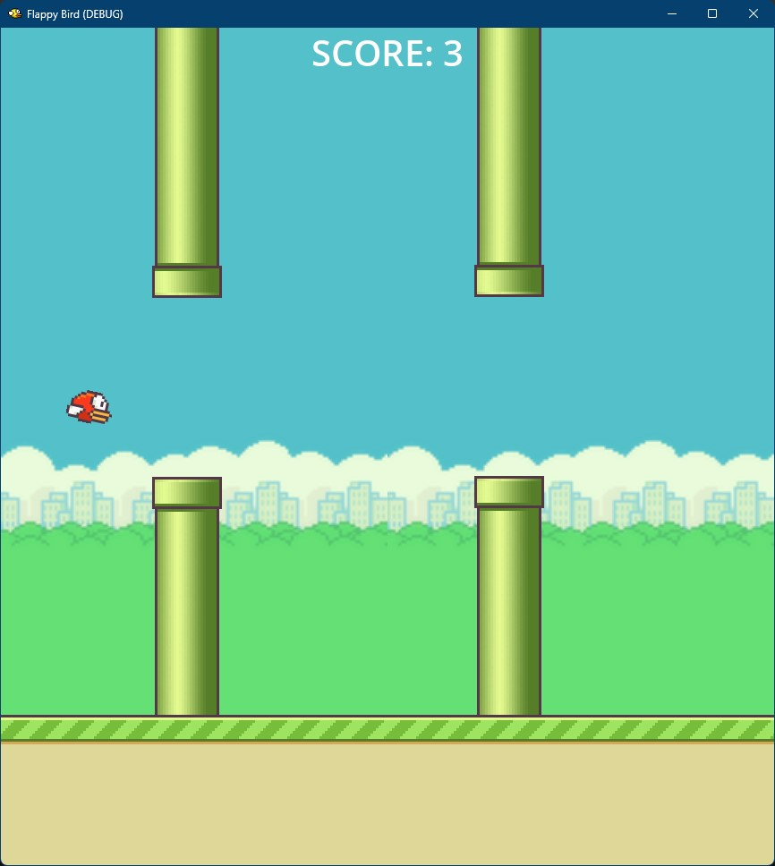

# Roar-plane / Рев-самолёт 🔷 [Beta]

> A Flappy Bird-style game where your child's plane flies by speaking "R" sounds — turning speech therapy into play.
> Летающая игра в стиле Flappy Bird, где самолёт ребёнка взлетает от звуков «Р» — превращая логопедические занятия в игру.



---

## 🔷 What makes this different

Most speech-practice apps are flashcard drills or phone-based exercises that feel like homework. Roar-plane is a **desktop game** where the core mechanic — keeping a plane in the air — is driven entirely by the child's voice. There's no keyboard, no mouse, no controller. The plane only responds to the "R" sound.

The game uses **offline speech recognition** (VOSK engine) running locally on your computer. No internet connection is needed after setup. No data is sent to any server. Your child's voice stays on your machine.

It supports **both Russian and English** syllables — "ро", "ри", "ру" on the Russian side, and English words like "red", "run", "car", "rain" on the English side. The interface language can be toggled in-game with one button.

Visual feedback is built in: a real-time microphone volume meter, glowing syllable cards that light up when the correct sound is detected, and floating text bubbles that rise from the plane. This gives the child immediate confirmation that their voice was heard and recognized.

---

## ✨ Features

- 🎤 **Voice-only control** — no keyboard or mouse needed; the plane flies on "R" sounds
- 🌍 **Bilingual support** — Russian syllables (ро, ри, ру) and English words (red, run, car, rain, rocket...)
- 📊 **Live volume meter** — real-time microphone level bar so the child can see their voice
- ✨ **Collectible stars** — golden stars in the gap between pipes award bonus points
- 🏆 **Score & high score** — tracks current score and personal best across sessions
- 📋 **Leaderboard** — top 5 scores saved locally with names and dates
- 🔄 **One-button restart** — game-over screen with restart; or just speak "R" again to relaunch
- 🌐 **In-game language toggle** — switch between Russian and English UI with one click
- 🎨 **Visual feedback** — syllable cards glow red, floating text appears on successful detection
- 📡 **Fully offline** — VOSK runs locally; no internet required after initial setup
- ⌨️ **Debug mode** — spacebar can substitute for voice input during testing

---


---

## 🚀 How to play

1. **Install** — download the game and place the VOSK model folder next to the executable (see below)
2. **Launch** — run the game; the microphone starts listening immediately
3. **Speak** — say any word with an "R" sound to make the plane fly up
4. **Dodge** — navigate through gaps between pipes; collect stars for bonus points
5. **Crash & retry** — hit a pipe or the ground? Speak "R" again to restart

### Setup

The VOSK speech model is **not** bundled in the game. Download it once:

```bash
curl -L https://alphacephei.com/vosk/models/vosk-model-small-en-us-0.15.zip -o vosk-model-small-en-us-0.15.zip
unzip vosk-model-small-en-us-0.15.zip -d vosk_models/
```

Then place the `vosk_models/` folder next to the game executable. Install the Python dependency:

```bash
pip3 install vosk
```

---

## 📖 Documentation

- [**Complete User Guide**](docs/GUIDE.md) — setup, gameplay, troubleshooting

---

## 🛠️ Tech

Godot 4.x (GDScript) · VOSK Speech Recognition · Python bridge · Zero external services
Desktop-first (macOS, Windows) · Single project folder · No build step to play from editor

---

## 💬 Feedback & Contact

This project is in active development.
Found a bug or have an idea? Reach out:

- **Telegram:** [@lexbayart](https://t.me/lexbayart)
- **GitHub Issues:** [Open an issue](https://github.com/lexbayart/Roar-plane/issues)

---

## 🧪 Dev Notes

`docs/` contains developer documentation: project architecture, requirements spec, development roadmap, and current state tracking.

---

## 📄 License

© 2025 lexbayart — [CC BY-NC 4.0](https://creativecommons.org/licenses/by-nc/4.0/)

Free to use, study, and share for non-commercial purposes with attribution.
Commercial use requires explicit written permission from the author.
